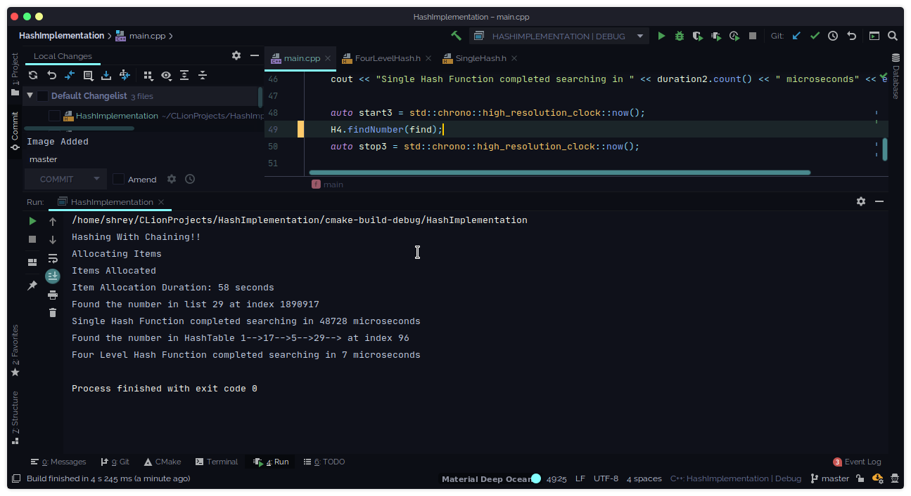

# Hash Implementation

This repository contains the C++ code for single level hash table and 4 level hash table.
Implementation for the classes are in headers files and comparison b/w them in are available in main.cpp

In [main.cpp](main.cpp) file a class object `H`  of SingleHash Class and `H4` of FourLevelHash Class are initialized.
In this code `H` contains 37 buckets and `H4` contains {23, 29, 31, 37} (prime numbers) multilevel buckets.

Executing the project give the result shown below.

In the output you can see that finding a number in SingleHash took 48728 microseconds and finding the same number in FourLevelHash took 7 microseconds.
The difference is Huge. That's why multilevel hashing is quite more useful when dealing with a large amount of data
